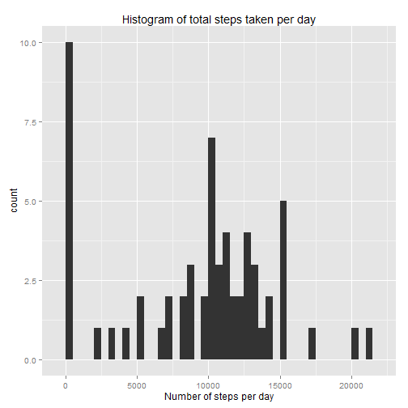
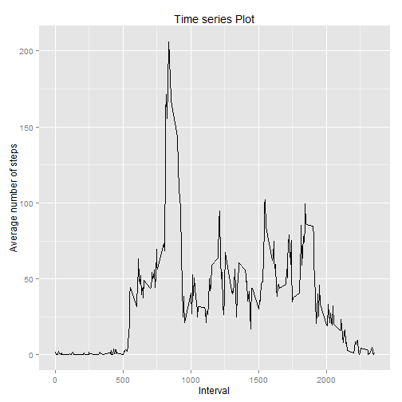
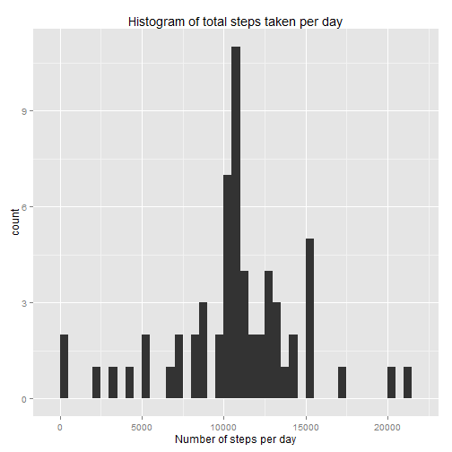
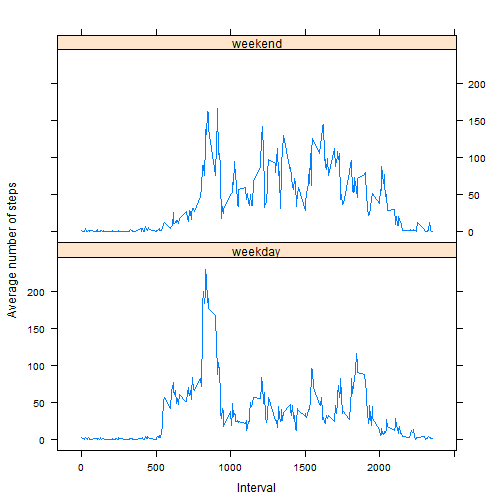

Reproducible Research: Assignment 1
-----------------------------------

### Introduction:

* This assignment makes use of data from a personal activity monitoring device. This device collects data at 5 minute intervals through out the day. The data consists of two months of data from an anonymous individual collected during the months of October and November, 2012 and include the number of steps taken in 5 minute intervals each day.

### Data:

* The variables included in this dataset are:

  1. steps: Number of steps taking in a 5-minute interval (missing values are coded as NA)

  2. date: The date on which the measurement was taken in YYYY-MM-DD format

  3. interval: Identifier for the 5-minute interval in which measurement was taken
  
### Loading required libraries:


```r
library(dplyr)
library(ggplot2)
library(lattice)
library(xtable)
```

### Loading and preprocessing the data:

* __Load the data__

```r
#Setting working directory
setwd("E:/Nilam/Coursera/Reproducible Research/Assignment1/")

#Read data from csv file
inputData <- read.csv("activity.csv")

#View internal structure of data
str(inputData)
```

```
## 'data.frame':	17568 obs. of  3 variables:
##  $ steps   : int  NA NA NA NA NA NA NA NA NA NA ...
##  $ date    : Factor w/ 61 levels "2012-10-01","2012-10-02",..: 1 1 1 1 1 1 1 1 1 1 ...
##  $ interval: int  0 5 10 15 20 25 30 35 40 45 ...
```

* __Process the data into a format suitable for your analysis__

```r
#Convert date from factor to date object
inputData$date <- as.Date(inputData$date)

#View internal structure of data
str(inputData)
```

```
## 'data.frame':	17568 obs. of  3 variables:
##  $ steps   : int  NA NA NA NA NA NA NA NA NA NA ...
##  $ date    : Date, format: "2012-10-01" "2012-10-01" ...
##  $ interval: int  0 5 10 15 20 25 30 35 40 45 ...
```

### What is mean total number of steps taken per day?

* __Calculate the total number of steps taken per day__

```r
#Total steps per day
sumData <- summarise(group_by(inputData,date),steps=sum(steps,na.rm=TRUE))
head(sumData)
```

```
## Source: local data frame [6 x 2]
## 
##         date steps
## 1 2012-10-01     0
## 2 2012-10-02   126
## 3 2012-10-03 11352
## 4 2012-10-04 12116
## 5 2012-10-05 13294
## 6 2012-10-06 15420
```

* __Make a histogram of the total number of steps taken each day__

```r
#Plotting histogram using ggpplot2
qplot(steps, data=sumData,binwidth=500, main="Histogram of total steps taken per day",xlab="Number of steps per day")
```

 


* __Calculate and report the mean and median of the total number of steps taken per day__

```r
#Mean and median of the total number of steps taken per day
summarise(sumData,Mean=mean(steps), Median=median(steps))
```

```
## Source: local data frame [1 x 2]
## 
##      Mean Median
## 1 9354.23  10395
```

### What is the average daily activity pattern?

* __Make a time series plot of the 5-minute interval and the average number of steps taken, averaged across all days__


```r
#Average number of steps by interval, averaged across all days
avgData <- summarise(group_by(inputData,interval), meanSteps=mean(steps, na.rm=TRUE))

#Time series graph for Average steps, averaged across all dayas by interval
qplot(interval,meanSteps,data=avgData,geom="line",xlab="Interval", ylab="Average number of steps", main="Time series Plot")
```

 

* __Which 5-minute interval, on average across all the days in the dataset, contains the maximum number of steps?__


```r
#Interval that contains maximum number of steps
avgData[which.max(avgData$meanSteps),]$interval
```

```
## [1] 835
```
The 835th interval has maximum 206.1698 steps

### Imputing missing values

* __Calculate and report the total number of missing values in the dataset__

```r
#Total missing values in data
sum(is.na(inputData))
```

```
## [1] 2304
```

* __Using "mean for that 5-minute interval" strategy for filling in all of the missing values in the dataset__

```r
#Average number of steps by interval, averaged across all days
avgData <- summarise(group_by(inputData,interval), meanSteps=mean(steps, na.rm=TRUE))

#Imputing missing values in new dataset
inputData2 <- inputData

for( i in 1: nrow(inputData2)){
  if(sum(is.na(inputData2[i,]))==1){
		inputData2[i,]$steps <- subset(avgData, interval==inputData2[i,]$interval)$meanSteps
	}
}

str(inputData2)
```

```
## 'data.frame':	17568 obs. of  3 variables:
##  $ steps   : num  1.717 0.3396 0.1321 0.1509 0.0755 ...
##  $ date    : Date, format: "2012-10-01" "2012-10-01" ...
##  $ interval: int  0 5 10 15 20 25 30 35 40 45 ...
```

```r
sum(is.na(inputData2))
```

```
## [1] 0
```
Zero missing values in new dataset

* __Make a histogram of the total number of steps taken each day__ 

```r
#Total steps per day
newsumData <- summarise(group_by(inputData2,date),steps=sum(steps,na.rm=TRUE))

#Plot histogram of total number of steps per day
qplot(steps, data=newsumData,binwidth=500, main="Histogram of total steps taken per day",xlab="Number of steps per day")
```

 

* __Calculate and report the mean and median total number of steps taken per day__

```r
mean(newsumData$steps)
```

```
## [1] 10766.19
```

```r
median(newsumData$steps)
```

```
## [1] 10766.19
```

* __Do these values differ from the estimates from the first part of the assignment?__  

Yes values differ from the estimates from first part of assignment.  

  1. Old Values:  
    -Mean: 9354.23  
    -Median: 10395  
    
  2. New Values:  
    -Mean: 10766.19   
    -Median:  10766.19  
    
* __What is the impact of imputing missing data on the estimates of the total daily number of steps?__  

  1. In old values there is difference between Mean and Median value, Mean is less than that of median value  
  2. When we impute missing values Mean value increases a lot and median value increase little and they becomes same  
  3. Increase in Mean value is due to increase in total number steps (i.e numerator) where as number of days remains same(denomenator)  
  4. Since total number of steps changes after imputing so Median value also chnages accordingly  


### Are there differences in activity patterns between weekdays and weekends?

* __Create a new factor variable with two levels - "weekday" and "weekend" indicating whether a given date is a weekday or weekend day__


```r
weekday <- function(date) {
    if (weekdays(date) %in% c("Saturday", "Sunday")) {
        return("weekend")
    } else {
        return("weekday")
    }
}

inputData2$day <- as.factor(sapply(inputData2$date, weekday))
meanWeek <- summarise(group_by(inputData2,interval,day), steps=mean(steps))
```
  
  
* __Make a panel plot containing a time series plot of the 5-minute interval and the average number of steps taken, averaged across all weekday days or weekend days__


```r
xyplot(steps ~ interval | day, meanWeek , type = "l", layout = c(1, 2), xlab = "Interval", ylab = "Average number of steps")
```

 
  
  
  
